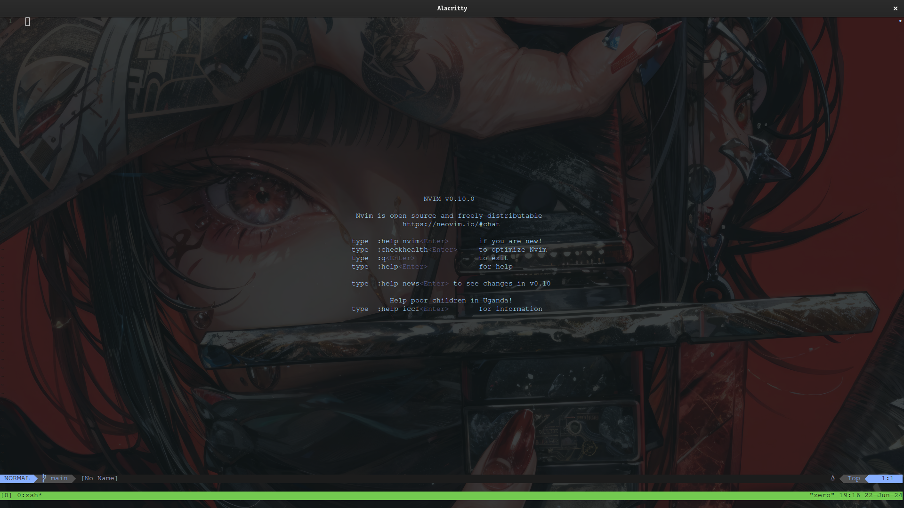
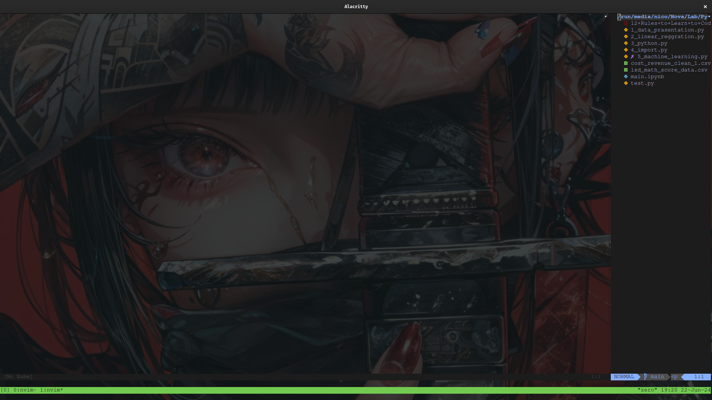
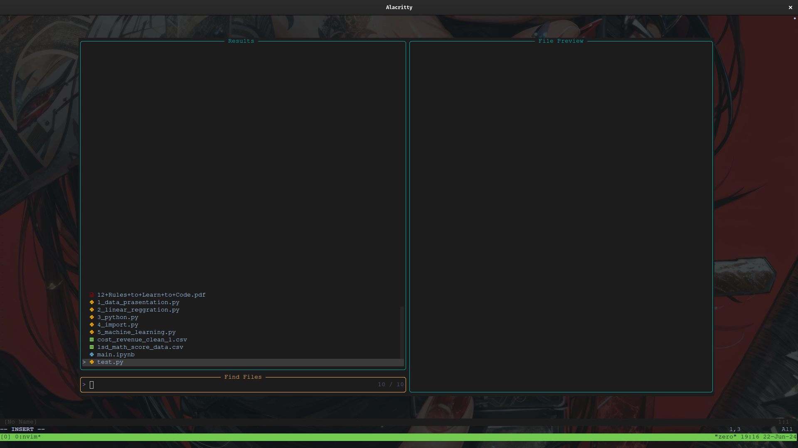
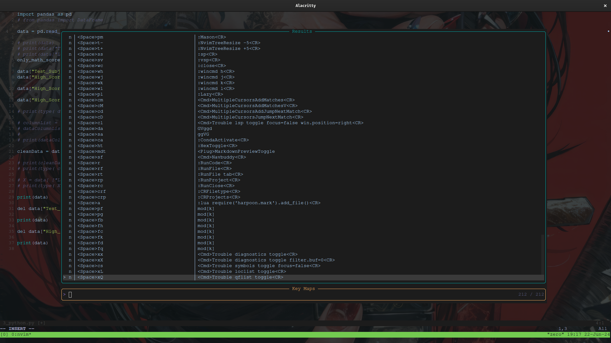
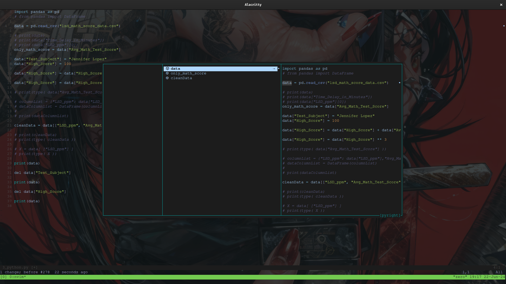
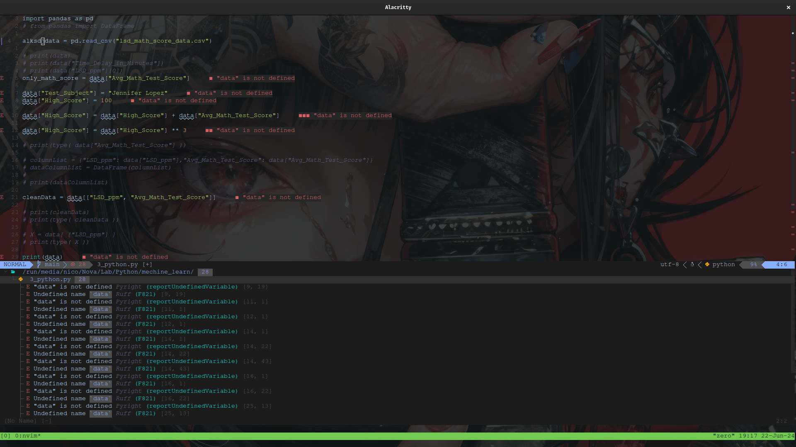

This is my Neovim config, and it is focused on python development env.

#### 1. Start



#### 2. File-Explorer



#### 3. Fuzzy-Finder



#### 4. Fuzzy-Keymaps-Finder



#### 5. NavBuddy



#### 6. Trouble



# You should install prerequisite
#### 1. Python
##### [Download and install from Python Site](https://www.python.org/downloads/).

#### 2. Anaconda
##### [Download and install form Anaconda Site](https://www.anaconda.com/download/success).

#### 3. Node 
```bash
# installs nvm (Node Version Manager)
curl -o- https://raw.githubusercontent.com/nvm-sh/nvm/v0.39.7/install.sh | bash
# download and install Node.js (you may need to restart the terminal)
nvm install 20
# verifies the right Node.js version is in the environment
node -v # should print `v20.14.0`
# verifies the right NPM version is in the environment
npm -v # should print `10.7.0`
```

#### 4 Node Dependency
```bash
# Install Node Dependancy
npm install @chemzqm/neovim log4js msgpack-lite neovim socket.io tslib typescript yarn
```
#### 5. Rust
```bash
# Install Rust
curl --proto '=https' --tlsv1.2 -sSf https://sh.rustup.rs | sh
```
#### 6. Git
```bash
# Arch Install
sudo pacman -S git

# Debian Install
sudo apt install git

# Check git version
git --version
```

# Setup Neovim config

#### 1. Neovim
```bash
# Arch Install
sudo pacman -S nvim

# Debian Install
sudo apt install nvim
```

#### 2. Clone this Repo
```bash
cd ~/.config/

git clone https://github.com/nico-Zero/nvim.git

```
That's it now just open nvim and wait for it to Setup itself.

Note: run `:checkhealth` this command in neovim after the setup is done to check the health of entire neovim.

# Config Explanation

This is the File Structure of the config :
```bash
.
├── after
│   └── plugin
│       ├── auto_close_setup_and_remaps.lua
│       ├── code_runner_and_remaps.lua
│       ├── colors.lua
│       ├── comment.lua
│       ├── gitsigns.lua
│       ├── harpoon.lua
│       ├── hex.lua
│       ├── ibl.lua
│       ├── lsp_config.lua
│       ├── lualine.lua
│       ├── multi_line_courser.lua
│       ├── nvim_tree.lua
│       ├── nvim-ts-autotag.lua
│       ├── scrollbar.lua
│       ├── telescope_remaps.lua
│       ├── toggleterm.lua
│       ├── tokyo_theme.lua
│       ├── treesitter.lua
│       └── trouble.lua
├── cht.sh
├── init.lua
├── lazy-lock.json
├── lua
│   └── nico
│       ├── init.lua
│       ├── lazy.lua
│       ├── remap.lua
│       └── set.lua
└── README.md
```
The File Structure is as per neovim's guide line.
The code flow of the config is like this:-

```bash
1. nvim will check the init.lua file in ~/.config/nvim.
2. There is require("nico"), it is going to /lua/nico.
3. It will run the /lua/nico/init.lua file next.
4. From that file it will run set.lua, remap.lua and lazy.lua.
5. After executing everything it will run all the file inside the 'after' dir.
6. This is the code flow of my nvim config.
```
Now, What things are in what file (Basic):-

#### 1. set.lua
```bash
# Do all your setup config in this file.
# Like
vim.opt.tabstop = 4
vim.opt.softtabstop = 4
vim.opt.shiftwidth = 4
vim.opt.expandtab = true

```

#### 2. Some Shortcuts for starters
```bash
# , reprasents sequance and - reprasents together.
1. Space,p,v    -> Open File Explorer
2. Space,p,f    -> Open Fizzy-File-Finder(Teleschope)
3. Space,p,m    -> Open Mason
4. Space,p,l    -> Open lazy
5. h            -> Left(Nevigation)
6. j            -> Down(Nevigation)
7. k            -> Up(Nevigation)
8. l            -> Right(Nevigation)
9. i            -> Go to insert mode.
10. Ctrl-c      -> Go to normal mode.
11. :q or :q!   -> Quit NeoVim.
```
There are more remaps in [remap.lua](https://github.com/nico-Zero/nvim/blob/main/lua/nico/remap.lua).

#### 3. remap.lua
```bash
# Write all your remap config in this file.
# Like:-
vim.keymap.set([MODE], [KEYBIND], [MAPPED TO])
```

#### 4. lazy.lua
```bash
# This is the file where you will write all you plugin install/load config's.'
# Like
require("lazy").setup({
    -- 1.Teleschope
    { # This is the link to the plugin Repo.
        'nvim-telescope/telescope.nvim', version = '0.1.6',
        -- or                            , branch = '3.1.x',
        dependencies = { {'nvim-lua/plenary.nvim'} }
    },
})
# After writing the config restart the nvim to install the plugin.
```
For detailed Explanation go to [Lazy.nvim](https://github.com/folke/lazy.nvim).

#### 5. after/plugin
```bash
If a plugin requires to call setup function then make a file with name 
of that plugin and write the setup function in that file call ':so' or 
restart the nvim after that.

Or Write any custom config for any plugin in this dir.

And read the docs of installed plugins from there repos, the lazy.lua install config is the path of installed plugin repo.
And This is the list of installed plugins...

1.Teleschope
2.Treesitter
3.Nvim-Tree
4.Tokyo-Night-Theam
5.Auto-Close
6.LuaLine
7.Indent-Blankline
8.ToggleTerm
9.Code-Runner
10.Drassing
11.GitSigns
12.Mason
13.Nvim-Cmp
14.Vsnip
15.Harpoon
16.Comment
17.Scroll-bar
18.Surround
19.Nvim-ts-AutoTag
20.Trouble
21.Multi-Line-Courser
22.Nvim-Conda
23.HexEditor
24.MarkDownPreview
25.NavBuddy

```
# Plugin Info
#### 1.Teleschope

It is a Fuzzy Finder tool for Vim/Neovim.
```bash
# This are my Teleschope Shortcuts in my config.
# , reprasents sequance and - reprasents together.
    Shortcuts     Modes         Info
1.  Leader,p,f    n         ->  Opens Fizzy-File-Finder (Teleschope)
2.  Leader,p,g    n         ->  Opens Rip-Grep (Teleschope)
3.  Leader,f,b    n         ->  Opens Fizzy-File-Finder in current opened buffers (Teleschope)
4.  Leader,f,h    n         ->  Opens Fuzzy-Help-Finder (Teleschope)
5.  Leader,f,c    n         ->  Opens Fuzzy-Command-Finder (Teleschope)
6.  Leader,f,k    n         ->  Opens Fuzzy-keymaps-Finder (Teleschope)
7.  Leader,f,d    n         ->  Runs The Teleschope.builtin.lsp_definitions function (Teleschope)
8.  Leader,f,q    n         ->  Opens Fizzy-QuickFix-Finder (Teleschope)
```

For detailed Docs - [Teleschope](https://github.com/nvim-telescope/telescope.nvim)

#### 2. Treesitter
This is nvim-treesitter the nvim version of [tree-sitter](https://github.com/tree-sitter/tree-sitter)
It also provides us a rich highlighting in neovim.

For detailed Docs - [Nvim-Treesitter](https://github.com/nvim-treesitter/nvim-treesitter)

#### 3. Nvim-Tree
This plugin provides the File-Explorer .

For detailed Docs - [Nvim-Tree](https://github.com/nvim-tree/nvim-tree.lua)

#### 4. Tokyo-Night-Theam
It is Tokyo-Night-Theam.

For detailed Docs - [Tokyo-Night-Theam](https://github.com/folke/tokyonight.nvim)

#### 5. Auto-Close
This plugin provides us the functionality Auto-Close tags, symbols, etc.
```bash
# You have to configer the Auto-Close plugin your self.
# In this nvim config i have wrote some config for Auto-Close.
# which provides us functionality like.
" -> ""
' -> ''
[ -> []
{ -> {}
( -> ()
` -> ``

# You can configer more as per your liking.
```

For detailed Docs - [Auto-Close](https://github.com/m4xshen/autoclose.nvim)

#### 6. LuaLine
This plugin provides with a simple tag at the bottom of vim/nvim which provides us information
about git branch, nvim modes, updates and deletion after last git commit, file name, system type,
formate type, file type , courser position, etc.

It is also configurable as per our liking.

For detailed Docs - [LuaLine](https://github.com/nvim-lualine/lualine.nvim)

#### 7. Indent-Blankline
This plugin provides indentation guides in nvim.

For detailed Docs - [Indent-Blankline](https://github.com/lukas-reineke/indent-blankline.nvim)

#### 8. ToggleTerm
This plugin provides us a nicer terminal ui.

```bash
# This are my ToggleTerm Shortcuts in my config.
# , reprasents sequance and - reprasents together.
    Shortcuts     Modes         Info
1.  Alt-\         All       ->  Toggles terminal (ToggleTerm)
```

For detailed Docs - [ToggleTerm](https://github.com/akinsho/toggleterm.nvim)

#### 9. Code-Runner
This plugin provides the code-running functionality in vim/nvim.
What is just do is takes is run code from its config and pastes it in terminal.
We can config every single file type code-run command in its config.

And it is also integrateable with toggleterm and etc.

```bash
# This are my Code-Runner Shortcuts in my config.
# , reprasents sequance and - reprasents together.
    Shortcuts     Modes         Info
1.  Leader,r      n         ->  Runs the code (Code-Runner)
2.  Leader,r,f    n         ->  Runs the entire file (Code-Runner)
3.  Leader,r,t    n         ->  Runs the entire file and opens it in new tab (Code-Runner)
4.  Leader,r,p    n         ->  Runs the entire project (Code-Runner)
5.  Leader,r,c    n         ->  Closes the running code. It is very usefull where the no insert mode (Code-Runner)
6.  Leader,c,r,f  n         ->  Opens json file with list of supported file types (Code-Runner)
7.  Leader,c,r,p  n         ->  Opens json file with list of project names (Code-Runner)
```

For detailed Docs - [Code-Runner](https://github.com/CRAG666/code_runner.nvim)

#### 10. Drassing 

This plugin provides us really beautiful UI for Insertion for commands.

For detailed Docs - [Drassing](https://github.com/stevearc/dressing.nvim)

#### 11. GitSigns

This plugin provides us Git blame functionality inside vim/nvim.

For detailed Docs - [GitSigns](https://github.com/lewis6991/gitsigns.nvim)

#### 12. Mason

This plugin manages all the LSP, DAP, Linter, Formatter. Install, Update, Uninstall, etc.

```bash
# This are my Mason Shortcuts in my config.
# , reprasents sequance and - reprasents together.
    Shortcuts     Modes         Info
1.  Leader,p,m    n         ->  Opens mason manager window (mason)
```

For detailed Docs - [Mason](https://github.com/williamboman/mason.nvim)

#### 13. Nvim-Cmp

This is the plugin which provides us the functionality of auto-completion in our vim/nvim.

```bash
# This are my Nvim-Cmp shortcuts in my config.
# , reprasents sequance and - reprasents together.
    shortcuts     modes                 Info
1.  Ctrl-b        suggestion open   ->  Scroll docs by 8 (nvim-cmp)
2.  Ctrl-f        suggestion open   ->  Scroll docs by 16 (nvim-cmp)
3.  Ctrl-Space    suggestion open   ->  Accepts the code suggestion (nvim-cmp)
4.  Ctrl-e        suggestion open   ->  Closes The suggestion window (nvim-cmp)
5.  Enter         suggestion open   ->  Accepts the selected code suggestion (nvim-cmp)
6.  Tab           suggestion open   ->  Scroll Down the suggestion window by 1 (nvim-cmp)
7.  Sift-Tab      suggestion open   ->  Scroll Up the suggestion window by 1 (nvim-cmp)
```

For detailed Docs - [Nvim-Cmp](https://github.com/hrsh7th/nvim-cmp)

#### 14. Vsnip
This plugin is the VScode(LSP) for vim/nvim.

For detailed Docs - [Vsnip](https://github.com/hrsh7th/vim-vsnip)

#### 15. Harpoon
This plugin save a file destination and in need we can quickly switch between that file at 
any instance of vim/nvim.

```bash
# This are my Harpoon shortcuts in my config.
# , reprasents sequance and - reprasents together.
    shortcuts     modes         Info
1.  Leader,a      n         ->  Adds the current opened file to harpoon saveed file list (Harpoon)
2.  Ctrl-e        n         ->  Opens the Harpoon window (Harpoon)

Note:- To delete the added file from the harpoon list.
       Just open the Harpoon window and dd the file destination you want to delete.
```

For detailed Docs - [Harpoon](https://github.com/ThePrimeagen/harpoon)

#### 16. Comment

This plugin provides the functionality of commenting the code with a short-cut.
```bash
# This are my Comment shortcuts in my config.
# , reprasents sequance and - reprasents together.
    Shortcuts     Modes         Info
1.  g,c,c         n         ->  Comments the current line (comment)
2.  g,b,c         n         ->  Block-Comments the current line (Comment)
3.  g,c           v         ->  Comments the current line (Comment)
4.  g,b           v         ->  Block-Comments the current line (Comment)
5.  g,c,0         n         ->  Dont know what the fuck it does (Comment)
6.  g,c,o         n         ->  Adds Comment to line below (Comment)
7.  g,c,A         n         ->  Adds Comment to end of the line (Comment)
```

It is also combinable with vim/nvim notions.

For detailed Docs - [Comment](https://github.com/numToStr/Comment.nvim)

#### 17. Scroll-bar
This plugin provides us a scrollbar functionality in vim/nvim which also 
tells us about errors and git blames.

For detailed Docs - [Scroll-Bar](https://github.com/petertriho/nvim-scrollbar)

#### 18. Surround
This a really powerful plugin which provides us the power of adding symbols
around texts.

There is too much going on this plugin in, so go and read Docs [Surround](https://github.com/kylechui/nvim-surround)

#### 19. Nvim-ts-AutoTag
This plugin provides us functionality of autoclose and autoedit html tags.

For detailed Docs - [Nvim-ts-AutoTag](https://github.com/windwp/nvim-ts-autotag)

#### 20. Trouble
This plugin provides the functionality of a error/warning window.
It is highly configurable.
```bash
# This are my Trouble shortcuts in my config.
# , reprasents sequance and - reprasents together.
    Shortcuts       Modes       Info
1.  Leader,x,x      n       ->  Toggles Trouble window (Trouble)
2.  Leader,x,X      n       ->  Toggles Trouble window with dignostics filter 0 (Trouble)
```

For detailed Docs - [Trouble](https://github.com/folke/trouble.nvim)

#### 21. Multi-Line-Courser
This plugin provides the functionality of multi line courser.

```bash
# This are my Multi-Line-Courser shortcuts in my config.
# , reprasents sequance and - reprasents together.
    Shortcuts           Modes       Info
1.  Alt-j               n       ->  Add Courser Down by 1 (Multi-Line-Courser)
2.  Alt-k               n       ->  Add Courser Up by 1 (Multi-Line-Courser) 
3.  Ctrl-LeftMouse      n       ->  Add Courser where click (Multi-Line-Courser) 
4.  Leader,c,m          n       ->  Add Courser to matches (Multi-Line-Courser) 
5.  Leader,c,M          n       ->  Add Courser to matches in Visual (Multi-Line-Courser) 
6.  Leader,c,d          n       ->  Add Courser to matches Down by 1 (Multi-Line-Courser) 
7.  Leader,c,D          n       ->  Add Courser to matches Down by 1 Jump (Multi-Line-Courser) 
8.  Leader,c,l          n       ->  Lock the courser (Multi-Line-Courser) 
```

For detailed Docs - [Multi-Line-Courser](https://github.com/brenton-leighton/multiple-cursors.nvim)

#### 22. Nvim-Conda
This plugin provides the functionality of conda activation from the vim/nvim --silent.

```bash
# This are my Nvim-Conda shortcuts in my config.
# , reprasents sequance and - reprasents together.
    Shortcuts           Modes       Info
1.  Leader,c,a          n       ->  Opens Conda Activate window (Nvim-Conda)
```

For detailed Docs - [Nvim-Conda](https://github.com/kmontocam/nvim-conda)

#### 23. HexEditor

This plugin provides the functionality of HexEditor in vim/nvim.
```bash
# This are my HexEditor shortcuts in my config.
# , reprasents sequance and - reprasents together.
    Shortcuts           Modes       Info
1.  Leader,h,t          n       ->  Toggles between hex mode and normal mode (HexEditor)

Note:- Changes done in hex mode will reflect in normal mode.
```

For detailed Docs - [HexEditor](https://github.com/RaafatTurki/hex.nvim)


#### 24. MarkDownPreview

This plugin provides the functionality of previewing it mrakdown in your browser.
```bash
# This are my MarkDownPreview shortcuts in my config.
# , reprasents sequance and - reprasents together.
    Shortcuts           Modes       Info
1.  Leader,m,d,t        n       ->  Toggles between MrakDownPreview mode and normal mode (MarkDownPreview)

```
When you move in your vim the MarkDownPreview in browser will move along too.

For detailed Docs - [MrakDownPreview](https://github.com/iamcco/markdown-preview.nvim)

#### 25. NavBuddy
This plugin provides the functionality of Nevigation between all variable, function, class,
modules, etc.

Really easily.
```bash
# This are my NavBuddy shortcuts in my config.
# , reprasents sequance and - reprasents together.
    Shortcuts           Modes       Info
1.  Leader,s,f          n       ->  Opens the NavBuddy Window (NavBuddy)
```

For detailed Docs - [NavBuddy](https://github.com/SmiteshP/nvim-navbuddy)

#### 26. Nvim-Cursorline
This plugin just adds underline to the matching words can be configured from its configuration file.

For detailed Docs - [Nvim-Cursorline](https://github.com/yamatsum/nvim-cursorline)

#### 27. Noice
This plugin makes UI look better.

#### 28. LuaRocks
This plugin is a Dependence for Treesitter.

___
***This is it,
Everything will run just fine after this.***

***But If you want to go deep in Nvim config [Nvim Docs](https://neovim.io/doc/).***

