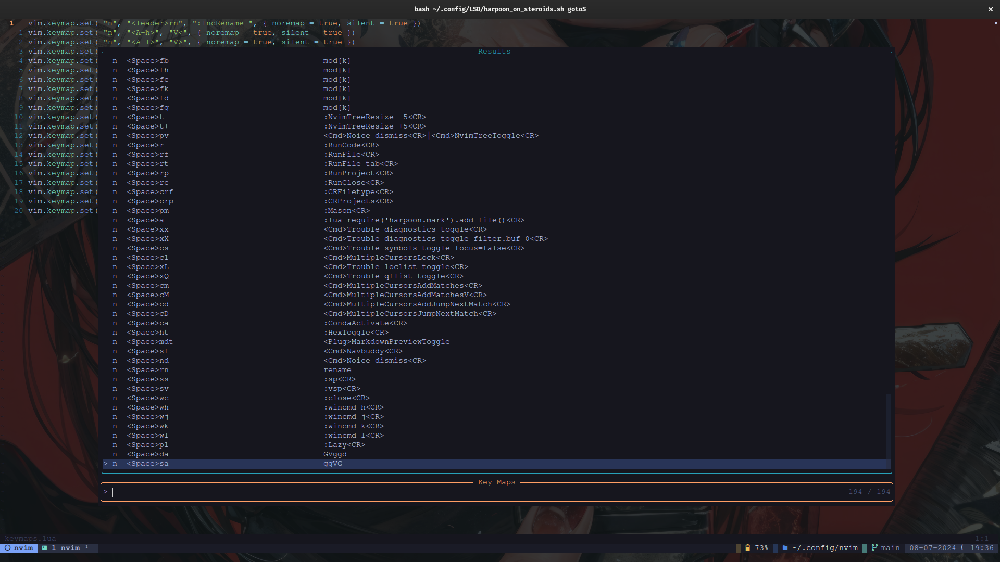
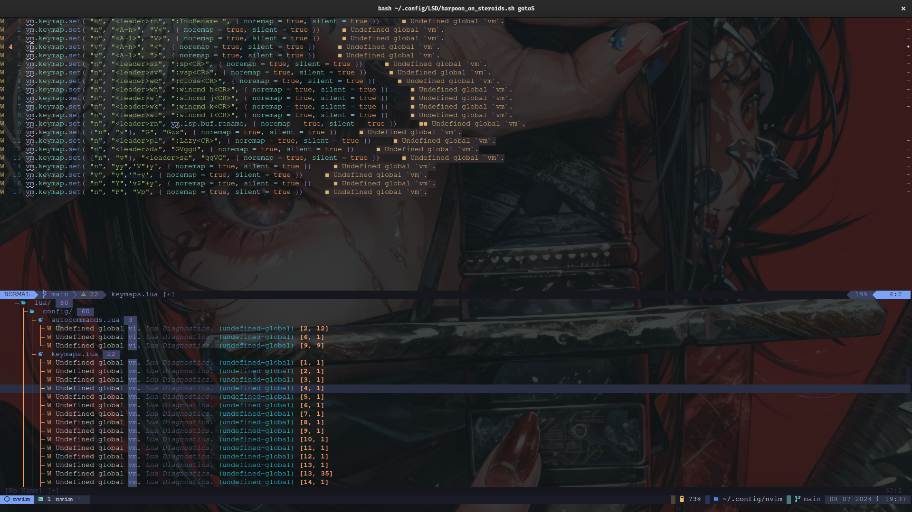

This is my Neovim config, and it is focused on python development env.

#### 1. Start


#### 2. File-Explorer


#### 3. Fuzzy-Finder


#### 4. Fuzzy-Keymaps-Finder



#### 5. NavBuddy


#### 6. Trouble



# Install prerequisite first.
#### 1. Python
##### [Download and install from Python Site](https://www.python.org/downloads/).

#### 2. Anaconda
##### [Download and install form Anaconda Site](https://www.anaconda.com/download/success).

#### 3. Node 
```bash
# installs nvm (Node Version Manager)
curl -o- https://raw.githubusercontent.com/nvm-sh/nvm/v0.39.7/install.sh | bash
# download and install Node.js (you may need to restart the terminal)
nvm install 20
# verifies the right Node.js version is in the environment
node -v # should print `v20.14.0`
# verifies the right NPM version is in the environment
npm -v # should print `10.7.0`
```

#### 4 Node Dependency
```bash
# Install Node Dependancy
npm install @chemzqm/neovim log4js msgpack-lite neovim socket.io tslib typescript yarn
```
#### 5. Rust
```bash
# Install Rust
curl --proto '=https' --tlsv1.2 -sSf https://sh.rustup.rs | sh
```
#### 6. Git
```bash
# Arch Install
sudo pacman -S git

# Debian Install
sudo apt install git

# Check git version
git --version
```

# Setup Neovim config

#### 1. Neovim
```bash
# Arch Install
sudo pacman -S nvim

# Debian Install
sudo apt install nvim
```

#### 2. Clone this Repo
```bash
cd ~/.config/

git clone https://github.com/nico-Zero/nvim.git

```
That's it now just open nvim and wait for it to Setup itself.

Note: run `:checkhealth` this command in neovim after the setup is done to check the health of entire neovim.

# Config Explanation

This is the File Structure of the config :
```bash
.
├── after
│   └── plugin
│       ├── colors.lua
│       └── remaps.lua
├── lua
│   ├── config
│   │   ├── autocommands.lua
│   │   ├── keymaps.lua
│   │   ├── lazy.lua
│   │   └── options.lua
│   └── plugins
│       ├── code_runner.lua
│       ├── comment.lua
│       ├── drassing.lua
│       ├── gitsigns.lua
│       ├── harpoon.lua
│       ├── hexeditor.lua
│       ├── indent_blankline.lua
│       ├── lazydev.lua
│       ├── lsp.lua
│       ├── lualine.lua
│       ├── luarocks.lua
│       ├── luasnip.lua
│       ├── markdownpreview.lua
│       ├── mini_pair.lua
│       ├── multi_line_courser.lua
│       ├── noice.lua
│       ├── nvim_colorizer.lua
│       ├── nvim_conda.lua
│       ├── nvim_cursorline.lua
│       ├── nvim_tree.lua
│       ├── nvim_treesitter_context.lua
│       ├── nvim_ts_autotag.lua
│       ├── scroll_bar.lua
│       ├── surround.lua
│       ├── telescope.lua
│       ├── theams.lua
│       ├── toggleterm.lua
│       ├── treesitter.lua
│       └── trouble.lua
└── README.md

```
The File Structure is as per lazy.nvim's guide line.
The startup flow of the config is like this:-

```bash
1. From the .config/nvim/init.lua file 4 things will be imported.
2. First ../lua/config/options.lua, All the Option config are in this file.
3. Second ../lua/config/lazy.lua, I am using Lazy as my plugin manager.
   - Then the Lazy imports all plugins from ../lua/plugins/ this dir to install and mantain.
   - Lazy will Automatically detects the changes in ../lua/config/ and ../lua/plugins/ dirs and
     live reloads the nvim with the new changes.

4. Third ../lua/config/keymaps.lua, I keep my nvim keymaps or remaps in this file [Note:- Not Plugins keymaps]
5. Fourth ../lua/config/autocommands.lua, I keep all autocommands in this file.
6. In dir ../.config/nvim/after/ ,Every file will be loded after the all other things are loded.
```
Now, What things are in what file (Basic):-

#### 1. Some Shortcuts for starters
```bash
# , reprasents sequance and - reprasents together.
1. Space,p,v    -> Open File Explorer
2. Space,p,f    -> Open Fizzy-File-Finder(Teleschope)
3. Space,p,m    -> Open Mason
4. Space,p,l    -> Open lazy
5. h            -> Left(Nevigation)
6. j            -> Down(Nevigation)
7. k            -> Up(Nevigation)
8. l            -> Right(Nevigation)
9. i            -> Go to insert mode.
10. Ctrl-c      -> Go to normal mode.
11. :q or :q!   -> Quit NeoVim.
```
There are more remaps in [remap.lua](https://github.com/nico-Zero/nvim/blob/main/lua/nico/remap.lua).

#### 2. options.lua
```bash
# Do all your setup config in this file.
# Like
vim.opt.tabstop = 4
vim.opt.softtabstop = 4
vim.opt.shiftwidth = 4
vim.opt.expandtab = true

```

#### 3. keymaps.lua
```bash
# Write all your remap config in this file.
# Like:-
vim.keymap.set([MODE], [KEYBIND], [MAPPED TO])
```

#### 4. lazy.lua
```bash
# This is the file where you will write all you plugin install/load config's.'
# Like
require("lazy").setup({
    -- 1.Teleschope
    { # This is the link to the plugin Repo.
        'nvim-telescope/telescope.nvim', version = '0.1.6',
        -- or                            , branch = '3.1.x',
        dependencies = { {'nvim-lua/plenary.nvim'} }
    },
})
# After writing the config restart the nvim to install the plugin.
```
For detailed Explanation go to [Lazy.nvim](https://github.com/folke/lazy.nvim).

#### 5. after/plugin/
In this, i have all the things, i want to Setup after the setup of whole nvim.

#### 6. lua/plugins/
This dir have all the plugins install and config setups.

A list of all the installed config:-

```bash
1.Telescope
2.Treesitter
3.Nvim-Tree
4.Tokyo-Night-Theam
5.Mini.nvim 
    -   [Note: Mini.nvim is install but only using mini.pair right now.
        List of all Mini.[x] -> https://github.com/echasnovski/mini.nvim

6.LuaLine
7.Indent-Blankline
8.ToggleTerm
9.Code-Runner
10.Drassing
11.GitSigns
12.Mason
13.Nvim-Cmp
14.LuaSnip
15.Harpoon
16.Comment
17.Scroll-bar
18.Surround
19.Nvim-ts-AutoTag
20.Trouble
21.Multi-Line-Courser
22.Nvim-Conda
23.HexEditor
24.MarkDownPreview
25.NavBuddy
26.Nvim-Cursorline
27.Noice
28.LuaRocks
29.Nvim-Treesitter-Context
30.Nvim-Colorizer

```
# Plugin Info
#### 1.Teleschope
It is a Fuzzy Finder tool for Vim/Neovim.
```bash
# This are my Teleschope Shortcuts in my config.
# , reprasents sequance and - reprasents together.
    Shortcuts     Modes         Info
1.  Leader,p,f    n         ->  Opens Fizzy-File-Finder (Teleschope)
2.  Leader,p,g    n         ->  Opens Rip-Grep (Teleschope)
3.  Leader,f,b    n         ->  Opens Fizzy-File-Finder in current opened buffers (Teleschope)
4.  Leader,f,h    n         ->  Opens Fuzzy-Help-Finder (Teleschope)
5.  Leader,f,c    n         ->  Opens Fuzzy-Command-Finder (Teleschope)
6.  Leader,f,k    n         ->  Opens Fuzzy-keymaps-Finder (Teleschope)
7.  Leader,f,d    n         ->  Runs The Teleschope.builtin.lsp_definitions function (Teleschope)
8.  Leader,f,q    n         ->  Opens Fizzy-QuickFix-Finder (Teleschope)
```

For detailed Docs - [Teleschope](https://github.com/nvim-telescope/telescope.nvim)

#### 2. Treesitter
This is nvim-treesitter the nvim version of [tree-sitter](https://github.com/tree-sitter/tree-sitter)
It provides a rich highlighting in neovim.

For detailed Docs - [Nvim-Treesitter](https://github.com/nvim-treesitter/nvim-treesitter)

#### 3. Nvim-Tree
It is a File-Explorer.

For detailed Docs - [Nvim-Tree](https://github.com/nvim-tree/nvim-tree.lua)

#### 4. Tokyo-Night-Theam
It is Tokyo-Night-Theam.

For detailed Docs - [Tokyo-Night-Theam](https://github.com/folke/tokyonight.nvim)

#### 5. Mini.Pair
Functionality of Auto-Close tags, symbols, etc.
```bash
# You have to configer the Auto-Close plugin your self.
# In this nvim config i have wrote some config for Auto-Close.
# which provides us functionality like.
" -> ""
' -> ''
[ -> []
{ -> {}
( -> ()
` -> ``

# You can configer more as per your liking.
```

For detailed Docs - [Mini.Pair](https://github.com/echasnovski/mini.pairs)

#### 6. LuaLine
Simple tag-linec at the bottom of vim/nvim where we can put information about current file and other stuffs like:
About git branch, nvim modes, updates and deletion after last git commit, file name, system type,
format type, file type, courser position, etc.

It is also configurable as per our liking.

For detailed Docs - [LuaLine](https://github.com/nvim-lualine/lualine.nvim)

#### 7. Indent-Blankline
Gives Indentation guides in nvim.

For detailed Docs - [Indent-Blankline](https://github.com/lukas-reineke/indent-blankline.nvim)

#### 8. ToggleTerm
A Nicer terminal then default one with better UI and it can be toggled, And is configurable as per liking.

```bash
# This are my ToggleTerm Shortcuts in my config.
# , reprasents sequance and - reprasents together.
    Shortcuts     Modes         Info
1.  Alt-\         All       ->  Toggles terminal (ToggleTerm)
```

For detailed Docs - [ToggleTerm](https://github.com/akinsho/toggleterm.nvim)

#### 9. Code-Runner
Code-running functionality in vim/nvim like is in VS-code.

And it is also integrateable with toggleterm and etc.

```bash
# This are my Code-Runner Shortcuts in my config.
# , reprasents sequance and - reprasents together.
    Shortcuts     Modes         Info
1.  Leader,r      n         ->  Runs the code (Code-Runner)
2.  Leader,r,f    n         ->  Runs the entire file (Code-Runner)
3.  Leader,r,t    n         ->  Runs the entire file and opens it in new tab (Code-Runner)
4.  Leader,r,p    n         ->  Runs the entire project (Code-Runner)
5.  Leader,r,c    n         ->  Closes the running code. It is very usefull where the no insert mode (Code-Runner)
6.  Leader,c,r,f  n         ->  Opens json file with list of supported file types (Code-Runner)
7.  Leader,c,r,p  n         ->  Opens json file with list of project names (Code-Runner)
```

For detailed Docs - [Code-Runner](https://github.com/CRAG666/code_runner.nvim)

#### 10. Drassing 
Better and more beautiful UI for Insertion of commands.

For detailed Docs - [Drassing](https://github.com/stevearc/dressing.nvim)

#### 11. GitSigns
Git blame functionality inside vim/nvim.

For detailed Docs - [GitSigns](https://github.com/lewis6991/gitsigns.nvim)

#### 12. Mason
Plugin manager for LSP, DAP, Linter, Formatter.

```bash
# This are my Mason Shortcuts in my config.
# , reprasents sequance and - reprasents together.
    Shortcuts     Modes         Info
1.  Leader,p,m    n         ->  Opens mason manager window (mason)
```

For detailed Docs - [Mason](https://github.com/williamboman/mason.nvim)

#### 13. Nvim-Cmp
Functionality of auto-completion in vim/nvim.

```bash
# This are my Nvim-Cmp shortcuts in my config.
# , reprasents sequance and - reprasents together.
    shortcuts     modes                 Info
1.  Ctrl-b        suggestion open   ->  Scroll docs by 8 (nvim-cmp)
2.  Ctrl-f        suggestion open   ->  Scroll docs by 16 (nvim-cmp)
3.  Ctrl-Space    suggestion open   ->  Accepts the code suggestion (nvim-cmp)
4.  Ctrl-e        suggestion open   ->  Closes The suggestion window (nvim-cmp)
5.  Enter         suggestion open   ->  Accepts the selected code suggestion (nvim-cmp)
6.  Tab           suggestion open   ->  Scroll Down the suggestion window by 1 (nvim-cmp)
7.  Sift-Tab      suggestion open   ->  Scroll Up the suggestion window by 1 (nvim-cmp)
```

For detailed Docs - [Nvim-Cmp](https://github.com/hrsh7th/nvim-cmp)

#### 14. LuaSnip
Functionality of creating your own snippts.
Some of them are:

1. Text-Transformations using Lua functions
2. Conditional Expansion
3. Defining nested Snippets
4. Filetype-specific Snippets
5. Choices
6. Dynamic Snippet creation
7. Regex-Trigger
8. Autotriggered Snippets
9. Easy Postfix Snippets

For detailed Docs - [LuaSnip](https://github.com/L3MON4D3/LuaSnip)

#### 15. Harpoon
Save a file destination and in need, We can quickly switch between that file at 
any instance of vim/nvim.

```bash
# This are my Harpoon shortcuts in my config.
# , reprasents sequance and - reprasents together.
    shortcuts     modes         Info
1.  Leader,a      n         ->  Adds the current opened file to harpoon saveed file list (Harpoon)
2.  Ctrl-e        n         ->  Opens the Harpoon window (Harpoon)

Note:- To delete the added file from the harpoon list.
       Just open the Harpoon window and dd the file destination you want to delete.
```

For detailed Docs - [Harpoon](https://github.com/ThePrimeagen/harpoon)

#### 16. Comment
Functionality of commenting the code with a short-cut.
```bash
# This are my Comment shortcuts in my config.
# , reprasents sequance and - reprasents together.
    Shortcuts     Modes         Info
1.  g,c,c         n         ->  Comments the current line (comment)
2.  g,b,c         n         ->  Block-Comments the current line (Comment)
3.  g,c           v         ->  Comments the current line (Comment)
4.  g,b           v         ->  Block-Comments the current line (Comment)
5.  g,c,0         n         ->  Dont know what the fuck it does (Comment)
6.  g,c,o         n         ->  Adds Comment to line below (Comment)
7.  g,c,A         n         ->  Adds Comment to end of the line (Comment)
```

For detailed Docs - [Comment](https://github.com/numToStr/Comment.nvim)

#### 17. Scroll-bar
Scrollbar functionality in vim/nvim which also shows errors and git blames.

For detailed Docs - [Scroll-Bar](https://github.com/petertriho/nvim-scrollbar)

#### 18. Surround
Really powerful plugin with which, Can put any symbol or html-tag around words, sentences, or lines etc.

There is too much going on this plugin in, so go and read Docs - [Surround](https://github.com/kylechui/nvim-surround)

#### 19. Nvim-ts-AutoTag
Functionality of autoclose and autoedit html tags.

For detailed Docs - [Nvim-ts-AutoTag](https://github.com/windwp/nvim-ts-autotag)

#### 20. Trouble
Functionality of a window which have the list of all the errors/warnings in the current file.
It is highly configurable.

```bash
# This are my Trouble shortcuts in my config.
# , reprasents sequance and - reprasents together.
    Shortcuts       Modes       Info
1.  Leader,x,x      n       ->  Toggles Trouble window (Trouble)
2.  Leader,x,X      n       ->  Toggles Trouble window with dignostics filter 0 (Trouble)
```

For detailed Docs - [Trouble](https://github.com/folke/trouble.nvim)

#### 21. Multi-Line-Courser
Functionality of multi-line-courser.

```bash
# This are my Multi-Line-Courser shortcuts in my config.
# , reprasents sequance and - reprasents together.
    Shortcuts           Modes       Info
1.  Alt-j               n       ->  Add Courser Down by 1 (Multi-Line-Courser)
2.  Alt-k               n       ->  Add Courser Up by 1 (Multi-Line-Courser) 
3.  Ctrl-LeftMouse      n       ->  Add Courser where click (Multi-Line-Courser) 
4.  Leader,c,m          n       ->  Add Courser to matches (Multi-Line-Courser) 
5.  Leader,c,M          n       ->  Add Courser to matches in Visual (Multi-Line-Courser) 
6.  Leader,c,d          n       ->  Add Courser to matches Down by 1 (Multi-Line-Courser) 
7.  Leader,c,D          n       ->  Add Courser to matches Down by 1 Jump (Multi-Line-Courser) 
8.  Leader,c,l          n       ->  Lock the courser (Multi-Line-Courser) 
```

For detailed Docs - [Multi-Line-Courser](https://github.com/brenton-leighton/multiple-cursors.nvim)

#### 22. Nvim-Conda
Functionality of conda activation from the vim/nvim is done in --silent.

```bash
# This are my Nvim-Conda shortcuts in my config.
# , reprasents sequance and - reprasents together.
    Shortcuts           Modes       Info
1.  Leader,c,a          n       ->  Opens Conda Activate window (Nvim-Conda)
```

For detailed Docs - [Nvim-Conda](https://github.com/kmontocam/nvim-conda)

#### 23. HexEditor
Functionality of HexEditor in vim/nvim.

```bash
# This are my HexEditor shortcuts in my config.
# , reprasents sequance and - reprasents together.
    Shortcuts           Modes       Info
1.  Leader,h,t          n       ->  Toggles between hex mode and normal mode (HexEditor)

Note:- Changes done in hex mode will reflect in normal mode.
```

For detailed Docs - [HexEditor](https://github.com/RaafatTurki/hex.nvim)

#### 24. MarkDownPreview
Functionality of previewing mrakdown in your browser.
```bash
# This are my MarkDownPreview shortcuts in my config.
# , reprasents sequance and - reprasents together.
    Shortcuts           Modes       Info
1.  Leader,m,d,t        n       ->  Toggles between MrakDownPreview mode and normal mode (MarkDownPreview)

```
When you move in your vim, The MarkDownPreview in browser will move along too.

For detailed Docs - [MrakDownPreview](https://github.com/iamcco/markdown-preview.nvim)

#### 25. NavBuddy
It opens a window the is like yazi terminal tool but it has destination of 
function atart, class start etc instade of file.

```bash
# This are my NavBuddy shortcuts in my config.
# , reprasents sequance and - reprasents together.
    Shortcuts           Modes       Info
1.  Leader,s,f          n       ->  Opens the NavBuddy Window (NavBuddy)
```

For detailed Docs - [NavBuddy](https://github.com/SmiteshP/nvim-navbuddy)

#### 26. Nvim-Cursorline
Adds underline on the matching words.

For detailed Docs - [Nvim-Cursorline](https://github.com/yamatsum/nvim-cursorline)

#### 27. Noice
Makes UI look better.

For detailed Docs - [Noice](https://github.com/folke/noice.nvim)

#### 28. LuaRocks
A provider of lazy.nvim.

For detailed Docs - [LuaRocks](https://github.com/vhyrro/luarocks.nvim)

#### 29. Nvim-Treesitter-Context
Makes the context of a class, function, list, json, etc. Stick in the top.

For detailed Docs - [Nvim-Treesitter-Context](https://github.com/nvim-treesitter/nvim-treesitter-context)

#### 30. Nvim-Colorizer
Show the actual color when writing any type of color code.

For detailed Docs - [Nvim-Colorizer](https://github.com/NvChad/nvim-colorizer.lua)
___
***This is it,
Everything will run just fine after this.***

***But If you want to go deep in Nvim config [Nvim Docs](https://neovim.io/doc/).***

